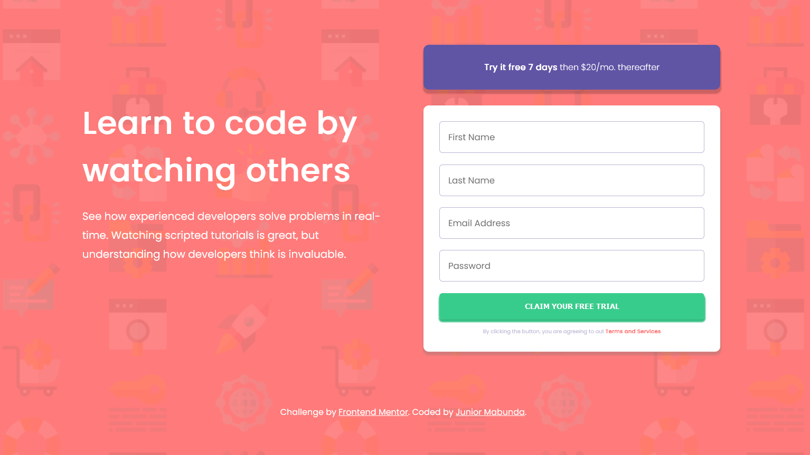

# Frontend Mentor - Intro component with sign up form solution

This is a solution to the [Intro component with sign up form challenge on Frontend Mentor](https://www.frontendmentor.io/challenges/intro-component-with-signup-form-5cf91bd49edda32581d28fd1). Frontend Mentor challenges help you improve your coding skills by building realistic projects.

## Table of contents

- [Overview](#overview)
  - [The challenge](#the-challenge)
  - [Screenshot](#screenshot)
  - [Links](#links)
- [My process](#my-process)
  - [Built with](#built-with)
  - [What I learned](#what-i-learned)
  - [Continued development](#continued-development)
  - [Useful resources](#useful-resources)
- [Author](#author)

## Overview

### The challenge

Users should be able to:

- View the optimal layout for the site depending on their device's screen size
- See hover states for all interactive elements on the page
- Receive an error message when the `form` is submitted if:
  - Any `input` field is empty. The message for this error should say _"[Field Name] cannot be empty"_
  - The email address is not formatted correctly (i.e. a correct email address should have this structure: `name@host.tld`). The message for this error should say _"Looks like this is not an email"_

### Screenshot

### Links

- Solution URL: [Intro Component With Sign Up Form Solution](https://your-solution-url.com)
- Live Site URL: [Intro Component With Sign Up Form](ejmabunda.github.io/fem-intro_component_with_sign_up_form)

## My process

### Built with

- Semantic HTML5 markup
- SCSS
- CSS custom properties
- Flexbox
- Mobile-first workflow
- Constraint Validation API

### What I learned

This challenge uses custom form validation which is a topic I haven't dived in, so I had to learn how to use the Constraint Validation API to complete this challenge.

### Continued development

The JS might be a bit messy, but it will be updated to prioritize efficiency as I learn more about the API and the JavaScript language itself.

### Useful resources

- [Client-side form validation (MDN)](https://developer.mozilla.org/en-US/docs/Learn/Forms/Form_validation) - This is where I learned about the Constraint Validation API, which enabled more control over the validation, and the look and feel.

## Author

- Frontend Mentor - [@ejmabunda](https://www.frontendmentor.io/profile/ejmabunda)
- GitHub - [@ejmabunda](https://github.com/ejmabunda/)
